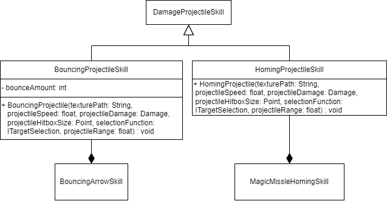

Titel: Konzeptskizze für Zyklus

Author: Bent Schöne, Marvin Petschulat, Edwin Dik

---
## Beschreibung der Aufgabe

In dieser Aufgabe implementieren Sie Projektile für den Fernkampf, damit der Held gegen die Monster auf Distanz kämpfen kann.

---

## Beschreibung der Lösung

Neue Skill Componente:
- Pfeil von Wänden abprallt
- Magic missile mit auto aim. Auf held oder monster

Damit bestimmte projektile die wände berühren auch abprallen oder projektile ihr ziel im flug ändern sollen.
Müssen wir das System für Projektile bearbeiten

---

## Methoden und Techniken

Javadoc

Methoden-Referenzen

Um das Ziel vom Skill festzulegen, können wir eine Methoden-Referenz auf die Klasse `SkillTools`
auf die Methode `getCursorPositionAsPoint` benutzen.

### Projektil "System" erklären

Jeder Skill der damage machen soll, kann die Klasse `DamageProjectileSkill` benutzen.
Wenn man ein neuen Skill erstellt muss dieser von der Klasse abgeleitet werden. Die neue Skill
klasse benötigt Texturen, Projektil geschwindigkeit, projektil schaden, projektil Hitbox größe,
ein Ziel und projektil range. Mit dieser Klasse kann man Ranged und Meele Skills erstellen.
Diesen neuen Skill kann man dann Entweder den Helden in der `PlayableComponent` klasse oder
einem NPC in der `MeleeAI` geben.

### Knockback beim treffen

In der Klasse `DamageProjectileSkill` existiert ein Lamda ausdruck der beschreibt was passiert wenn
eine Entität getroffen wird. Dort können wir einfügen, dass die Velocity von der getorffenen Entität
je nach richtung erhöht wird

---

## Ansatz und Modellierung

