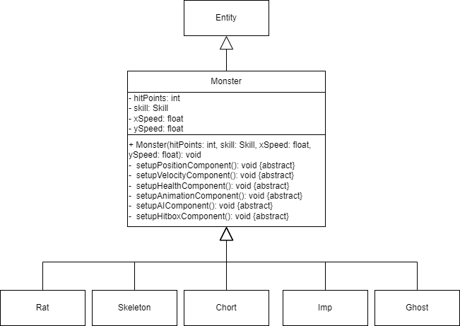

#### Titel: Konzeptskizze für Zyklus 1

#### Author: Bent Schöne, Marvin Petschulat, Edwin Dik

---
## Beschreibung der Aufgabe

Das Dungeon soll um folgende 5 Gegner erweitert werden:
- Ratte
- Skelett
- Imp
- Chort
- Geist

Die Monster haben bestimmte Eigenschaften und bewegen sich mithilfe von unterschiedlichen AI's
im Dungeon herum.

Außerdem wird das Dungeon um eine IdleAI-Strategie erweitert, die SleepingAI.

---

## Beschreibung der Lösung

### Eigenschaften der Monster
Ratte

| Verhalten | Leben | Geschwindigkeit | Wander Verhalten              |
|-----------|-------|-----------------|-------------------------------|
| Passiv    | 1HP   | 0.1             | Patrouille durchs ganze level |

Skelett

| Verhalten | Leben | Geschwindigkeit | Angriff           | Schaden | Wander Verhalten               |
|-----------|-------|-----------------|-------------------|---------|--------------------------------|
| Aggressiv | 3HP   | 0.05            | Fernkampf (Bogen) | 1HP     | in einem kleinen Radius (fest) |

Imp

| Verhalten | Leben | Geschwindigkeit | Angriff                | Schaden | Wander Verhalten               |
|-----------|-------|-----------------|------------------------|---------|--------------------------------|
| Aggressiv | 2HP   | 0.15            | Fernkampf  (Feuerball) | 1HP     | in einem kleinen Radius (fest) |

Chort

| Verhalten | Leben | Geschwindigkeit | Angriff  | Schaden | Wander Verhalten              |
|-----------|-------|-----------------|----------|---------|-------------------------------|
| Aggressiv | 4HP   | 0.15            | Nahkampf | 2HP     | Patrouille durchs ganze level |

Geist

| Verhalten | Leben | Geschwindigkeit | Angriff                     | Schaden | Wander Verhalten              | Besonderheit                                                     |
|-----------|-------|-----------------|-----------------------------|---------|-------------------------------|------------------------------------------------------------------|
| Passiv    | 2HP   | 0.25            | Nahkampf und Kontaktschaden | 1HP     | Patrouille durchs ganze level | Kann durch Wände fliegen und wird unsichtbar außerhalb vom Level |

### Verhalten der Monster
#### Angriffsverhalten
- Jedes Monster benutzt die `MeleeAI` um anzugreifen
- Passive Monster benutzen die `SelfDefendTransition`
- Aggressive Monster benutzen die `RangeTransition`
#### Wander Verhalten
- Damit das Monster durch das ganze Level patrouillieren kann benutzt es `PatrouilleWalk` mit einem großen Radius
- Monster die nur in einem kleinen Radius wandern sollen benutzen `StaticRadiusWalk`

### Spawnen der Monster

In der Klasse `game/src/starter/Game.java` existiert eine Methode `onLevelLoad()`
die jedes Mal ausgeführt wird wenn ein neues Level geladen wird. Dort können wir den Code einbauen, der
eine Zufällige anzahl an unterschiedlichen Monstern Spawnt. Dabei soll die Stärke und Häufigkeit der Monster
abhängig von der Tiefe sein.

Für die Tiefe müssen wir eine neue Variable einfügen die hochzählt jedes Mal wenn die Methode `onLevelLoad()`
in `Game.java` ausgeführt wird.

Damit die Monster im Spiel erscheinen muss ein Objekt des Monsters in der Methode `onLevelLoad()` erstellt werden,
die Klasse `Entity.java` übernimmt das Hinzufügen des Entity zum Game und der `PositionComponent.java` übernimmt
den Spawnpunkt im Level.

### Ebenen System im Dungeon
| ab Ebene 1 | ab Ebene 3  | ab Ebene 6            | ab Ebene 10         |
|------------|-------------|-----------------------|---------------------|
| Ratten 0-2 | Geister 1-2 | Skelette und 1-2 Imps | Imps und Chorts 1-4 |

### Neue IdleAI-Strategie: SpleepingAI

Bei der SleepingAI bleibt ein Monster in einer Art Ruhezustand auf einer Stelle stehen, bis der Held
einen bestimmten Radius betritt, danach wacht das Monster auf und wechselt auf eine andere IdleAI um sich
wieder zu bewegen.

### AISystem Erklärung
Um einem Monster eine AI zu geben, muss man folgendes festlegen:
- FightAI
    - Wie das Monster den Spieler angreifen soll, wenn es aggressiv ist
        - `CollideAI`: Bewegt sich auf den Spieler zu und attackiert dann durch Kollidieren
        - `MeleeAI`: Bewegt sich auf den Spieler zu bis zu einer festgelegten Range und attackiert dann
          mit dem festgelegten Skill
- IdleAI
    - Wie sich das Monster verhält, wenn kein Spieler in der Nähe ist
        - `PatrouilleWalk`: Generiert n viele zufällig positionierte Punkte in einem festgelegten Radius.
          Das Verhalten wie sich das Monster bewegt wird durch ein enum `MODE` gesteuert
        - `RadiusWalk`: Generiert einen zufälligen Punkt in einem festgelegten Radius und bewegt sich dort hin.
          Danach wird ein weiterer Punkt von dieser Position aus generiert
        - `StaticRadiusWalk`: Generiert einen zufälligen Punkt in einem festgelegten Radius und bewegt sich dort hin.
          Dabei bleibt der Startpunkt vom Radius gleich
- TransitionAI
    - Ab wann das Monster aggressiv wird
        - `RangeTransition`: Das Monster wird aggressiv, wenn der Spieler in einem gegebenen Radius ist
        - `SelfDefendTransition`: Das Monster wird nur aggressiv, wenn es schaden erleidet

---

## Methoden und Techniken

Aus den Vorlesungen haben wir Git, Javadoc, Methoden Referenzen und Lambda-Ausdrücke kennengelernt.

Damit jeder von uns einen aktuellen Stand vom Spiel hat, haben wir ein repository auf
Github erstellt in welchem wir unsere änderungen verwalten können.

Außerdem damit jeder der, den von uns geschriebenen Code in der Zukunft liest, diesen auch versteht
und wir eine einheitliche Dokumentation zum vorhandenen Code beibehalten, benutzen wir für bestimmte Klassen,
Methoden und Attribute Javadoc-Kommentare um z.B. auch besonderheiten wie Annotationen benutzen zu können.

Methoden-Referenzen und Lambda-Ausdrücke sind in vielen Teilen des vorhandenen Codes enthalten, dadurch das beide
Techniken kürzlich neu durch die Vorlesungen eingeführt worden sind und sie somit noch nicht ausführlich angewendet
werden konnten, wird sich in der Implementierungsphase herausstellen, ob sie in den Aufgaben Monster, Nahkampf und Fernkampf
eine sinnvolle Anwendung finden.

---

## Ansatz und Modellierung

