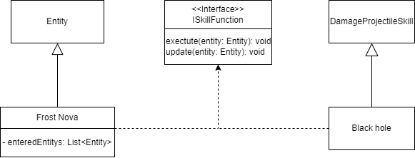

Titel: Konzeptskizze für Zyklus 2

Author: Bent Schöne, Marvin Petschulat, Edwin Dik

---

## Beschreibung der Aufgabe

Implementierung von zwei Fähigkeiten, welche der Spieler nutzen kann. Der Spieler soll mit
den Zaubern/Fähigkeiten keinen Schaden verursachen. Die Fähigkeiten sollen von
Ressourcen wie Lebenspunkte (HP), Mana (MP) oder Ausdauer abhängig sein.

Bei jedem Level aufstieg sollen die Charakterwerte des Helden erhöht werden und der Held
soll die Zaubersprüche/Fähigkeiten erlernen können.

Zusätzlich soll das bereits vorhandene Skill-System, Feuerball-Skill und XP-System
analysiert und ihre Funktionalitäten erläutert werden.

---

## Beschreibung der Lösung

Gravity Storm / Black hole:

| Kosten | Cooldown | Freigeschalten ab | Verhalten               | Effekt               | Hotkey |
|--------|----------|-------------------|-------------------------|----------------------|--------|
| 5 MP   | 30 sec   | LVL 10            | Langsam fliegender ball | Zieht gegner in sich | 2      |

Frost Nova:

| Kosten | Cooldown | Freigeschalten ab | Verhalten                   | Effekt             | Hotkey |
|--------|----------|-------------------|-----------------------------|--------------------|--------|
| 2 MP   | 10 sec   | LVL 5             | Kreis aus Eis unterm Helden | Verlangsamt um 30% | 1      |

Neue tastenbelegung werden in dungeon_configs.json festgelegt.

### Mana implementierung

In der Klasse SkillComponent werden neue Variablen `int maxMana, int currentMana` hinzugefügt. Diese werden
für Skills benutzt. Jede sekunde wird 1 Mana regeneriert. `maxMana` Skaliert mit dem Hero level.

Wir haben uns überlegt das alle Skills wie Feuerball und Spark auch Mana kosten bekommen
(Feuerball = 1MP, Spark = 3MP).

### XP-System

Das XP-System holt sich von allen Entities im Spiel dessen XPComponent. Ist von einem
Entity das benötigte XP erreicht, um einen LevelUp durchzuführen, so wird die
performLevelUP() Methode im XP-System aufgerufen.

In dieser Methode wird das level von der Entity erhöht. Danach wird die XP vom Entity auf
`xpLeft` gesetzt. Als Letztes wird die LevelUp Methode von der Entity aufgerufen.

### XP-Component

Das XP-Component verwaltet, wie viel XP ein Entity braucht, um in das nächste Level (nicht
das Dungeon Level gemeint) zu steigen oder wie viel XP ein Entity "fallen lässt", wenn es
besiegt wird. Bei einem LevelUp wird mit der Formel:
`neededXP = 0.5 * level^2 + 100` die für das nächste Level benötigte Anzahl an XP berechnet.

Wenn ein Entity besiegt wird, dann wird mit der Methode getLootXP() die Anzahl an XP
über gegeben. Wurde kein Wert für den zu übergebenden XP gesetzt (lootXP == -1), dann
wird die Hälfte der Menge an XP, die das Entity enthält, übergeben.

---

### Skill-System

In der klasse SkillSystem wird jeden Frame die Methode update() ausgeführt.
Diese methode reduziert alle cool-downs für alle Skills für jede Entity die ein
SkillComponent haben.

### Skill-Component

In der Klasse SkillComponent wird eine Liste aus Skills gespeichert. Diese Liste kann man mit get, add und remove
manipulieren.
Von allen Skills wird der Cooldown von SkillSystem reduziert mithilfe der Methode reduceAllCoolDowns() in
SkillComponent.

#### Beispiel Skill: Feuerball

Um ein FireballSkill zu erstellt wird in dem Konstruktor der Oberklasse DamageProjectileSkill:

- Der Path der Texturen
- Die Geschwindigkeit
- Der Schadenstyp und Wert
- Die Position
- Das Ziel des Projektils
- Die Reichweite

des FireballSkills übergeben.

???

Dieser Skill wird nicht wie erwartet in einem SkillComponent geschpeichert sondern
in der PlayableComponent vom Helden

???

---

## Methoden und Techniken

Keine Pattern. logger ?

---

## Ansatz und Modellierung

In PlayableComponent und in der MeleeAI gibt es Skill Variablen die festhalten welche skills die Entitäten haben.
Wir haben uns überlegt diese variablen zu entfernen dafür ein SkillComponent hinzuzufügen der alle skills speichert.

Weil beide unserer Skills und manche zukünftigen skills jeden Frame geupdated werden müssen haben wir uns überlegt
in dem Interface `ISkillFuncion` eine update() Methode hinzuzufügen. Diese Methode wird dann in der Game Klasse
jeden Frame aufgerufen.

Back Hole:
- execute()
  - neues Projektil erstellt
- update()
  - alle entities in der Nähe ran gezogen

Frost Nova:

- execute()
  - Neue Entity erstellt mit einer Hitbox
  - Bei onHitboxEnter wird die Entity ge-slowed und in eine Liste gespeichert
  - Bei onHitboxLeave wird die Entity schneller gemacht und aus der Liste entfernt
- update()
  - Eine Variable die bestimmt wie lange die Frostnova existiert. Diese wird jeden Frame
    reduziert. Wenn sie bei 0 angekommen ist, werden alle entities in der liste schneller gemacht
    und die Frost Nova entfernt

---

## UML

