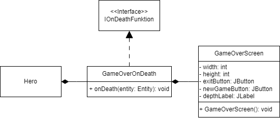

# Game-Over

Titel: Konzeptskizze für Zyklus 2

Author: Bent Schöne, Marvin Petschulat, Edwin Dik

---
## Beschreibung der Aufgabe

#### Game-Over Screen

Dem Spieler soll es ermöglicht werden zu sterben. Nachdem der Spieler stirbt, hat er 2 Möglichkeiten,
entweder beendet er das Spiel oder er startet einen neuen Versuch.

---

## Beschreibung der Lösung

Wenn der Spieler stirbt wird das Spiel pausiert und ein neues Fenster geöffnet. In dem Fenster steht Game-Over und man
hat die möglichkeit das Spiel neuzustarten oder es zu beenden mithilfe von 2 Buttons.

---

## Methoden und Techniken

Eine LibGDX Applikation kann durch den Befehl `Gdx.app.exit();` sicher beendet werden.

---

## Ansatz und Modellierung

Damit wir Code ausführen können wenn der Spieler stirbt, benutzen wir die `IOnDeathFunction onDeath` Variable im HealthComponent
vom Hero. Wir erstellen eine neue Klasse `GameOverOnDeath`, welche das IOnDeathFunction Interface implementiert, von dieser
Klasse wird dann ein Objekt erstellt und in der Variable `onDeath` gespeichert. In `GameOverOnDeath` wird dann eine Funktion erstellt, welche das
Game-Over Fenster öffnet.

Um das Spiel neuzustarten könnte man die Setup Methode aus der Game Klasse aufrufen.

---

## UML

