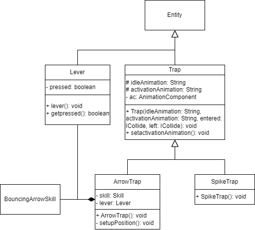

Titel: Konzeptskizze für Zyklus 3

Author: Bent Schöne, Marvin Petschulat, Edwin Dik

---
## Beschreibung der Aufgabe

Fallen im Dungeon implementieren

---

## Beschreibung der Lösung

Spikefalle:
- Spikes die dmg verursachen, wenn der Held darüber läuft
- kann nur 1 mal schaden machen

Pfeilfalle:
- schießt ein pfeil wenn der held vor der falle rennt
- längerer cooldown
- schalter der die falle aus macht

---

## Methoden und Techniken

Javadoc, git, logger beim erstellen

---

## Ansatz und Modellierung

Es wird eine neue Oberklasse ``Trap`` erstellt. Diese Klasse kümmert sich darum,
die Entity zu erstellen und diese alle Components zu geben.

Die Klasse ``SpikeTrap`` erbt von der Oberklasse ``Trap``. In dem Konstruktor werden
2 neue ICollide Funktionen erstellt die weitergegeben werden. In diesen Funktionen wird
beschrieben wie die Falle schaden macht.

neue abstracte hilfmethdoe getposFromRandomWall()

Neue ober klasse Falle:
- falle(String texture davor, String texture während, String textur dannach, onhiboxenter, onhitboxleave)
- setupEntity
  - neue entity mit pos, anim, hitbox comp
- animationTodavor
- animationTowährent
- animationtodannach

spikefalle:
- spikefalle
  - hitbox die dmg macht
  - animation ändert mit hilferbool

pfeilfalle:
- schalter variable
- pefilfalle
  - neue entity
  - mit langer hitbox in die gegengesetzte richtung von wand
  - hitboxenter:
    - wenn pressed false neue animtaion
    - neu pfeil
- changehitbox()
  - ändert hitbox länge

Schalter klasse:
- boolean pressed
- schalter
  - erstellt neue entity
  - hitbox wenn hero entered pressed = true
---

## UML

