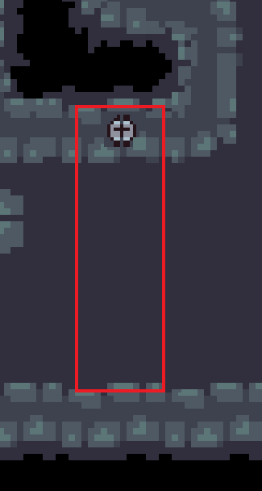

# Fallen

Titel: Konzeptskizze für Zyklus 3

Author: Bent Schöne, Marvin Petschulat, Edwin Dik

---
## Beschreibung der Aufgabe

Es sollen 2 neue Fallen im Dungeon implementiert werden.

Eine Falle kann von dem Hero oder einem Monster ausgelöst werden. Dabei können die Fallen
verschiedene Funktionen haben.

Einige Fallen können durch Schalter deaktiviert werden.

---

## Beschreibung der Lösung

Implementiert wird eine Spikefalle, die Schaden verursacht, wenn der Spieler darüber läuft. Die Spikefalle kann durch
einen Hebel im Level deaktiviert werden. Dabei verursacht die Spike falle 2 Schaden, wenn sie zum ersten Mal ausgelöst
wurde und sonst 1 Schaden. Damit der Spieler nicht mehrmals in einer kurzen Zeit von der gleichen Spike falle, Schaden
bekommt, wird ein Cooldown implementiert.

Die zweite Falle ist eine Pfeilfalle, die ein Pfeil schießt, wenn der Spieler davor rennt. Die Pfeilfalle benutzt die vorhandene
``BouncingArrowSkill`` um einen Pfeil zu schießen. Der Pfeil verursacht 3 Schaden und hat 2 Sekunden Cooldown.

---

## Methoden und Techniken

Methoden werden wieder gemäß der Vorlesung mit Javadoc dokumentiert.

Für die Versionskontrolle wird Git verwendet.

Logging wird schon durch die Klasse ``Entity`` übernommen, wenn eine neue Falle erstellt wird.

---

## Ansatz und Modellierung

Es wird eine neue Oberklasse ``Trap`` erstellt. Diese Klasse kümmert sich darum,
die Entity zu erstellen und diese alle Components zu geben.
#### SpikeFalle
Um die Spikefalle zu implementieren, erstellen wir eine neue Klasse ``SpikeTrap``, die von der Klasse ``Trap`` erbt.
Im Konstruktor von SpikeTrap wird eine neue ICollide lambda Funktion erstellt. Diese Funktion definiert, wie und wann die
Spikefalle Schaden verursacht.
#### Pfeilfalle
Für die Pfeilfalle erstellen wir eine neue Klasse ``ArrowTrap``, die von der Klasse ``Trap`` erbt.
Im Konstruktor von ArrowTrap wird eine neue ICollide lambda Funktion erstellt. Diese Funktion entscheidet, wann die Pfeilfalle
ein Pfeil schießt. Außerdem wird die Methode ``setupRandomWallPosition()`` aufgerufen.

Wir haben uns überlegt, dass die Pfeilfalle ein langes Rechteck als Hitbox hat, um zu prüfen, wann der Spieler vor die Pfeilfalle rennt.
Um unsere Idee umzusetzen, erstellen wir eine neue Methode ``setupRandomWallPosition()``, die, die Position von der Pfeilfalle auf eine zufällige Wand setzt
und die Richtung der Falle definiert. Danach wird die Größe der Hitbox so geändert, dass die Hitbox ein langes Rechteck im Blickrichtung der Falle ist.

#### Schalter
Um einen Schalter zu implementieren, erstellen wir eine neue Klasse ``Lever``, die von Entity erbt.
Im Konstruktor wird eine neue Entity mit AnimationComponent, PositionComponent und InteractionComponent erstellt.
Zudem wird die Position vom Schalter auf eine zufällige Wand gesetzt.
Der Schalter hat eine boolean variable, die sich auf true setzt, wenn der Schalter vom Spieler betätigt wird.

---

## UML

