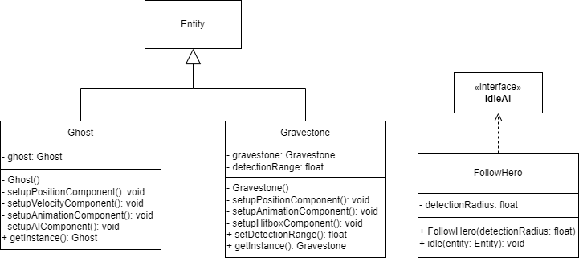

# Freundlicher NPC-Geist

Titel: Konzeptskizze für Zyklus

Author: Bent Schöne, Marvin Petschulat, Edwin Dik

---
## Beschreibung der Aufgabe

Es soll ein freundlicher Geist als NPC im Dungeon implementiert werden, welcher entweder den Spieler langsam
verfolgt, zufällig durch das Level wandert oder auch manchmal verschwindet.

Darüber hinaus, soll ein Grabstein implementiert werden, der im Level mit einem Geist platziert wird. Findet der Spieler
den Grabstein, während der Geist ihn verfolgt, soll der Spieler belohnt werden.

---

## Beschreibung der Lösung

Der Geist hat eine Chance im Level zu spawnen und bewegt sich dann zufällig durch das Level. Wenn der Spieler
eine bestimmte Range zum Geist betritt fängt der Geist an den Spieler langsam zu verfolgen.

Der Spieler soll den Geist nicht angreifen können und auch er selbst soll nicht vom Geist angegriffen werden.

Wenn der Geist spawnt, spawnt auch der Grabstein im Level, also immer wenn der Geist im Level ist, ist
auch ein Grabstein da, damit nicht nur eins von beiden im Level ist.

Findet der Spieler den Grabstein, wenn der Geist ihn verfolgt, bekommt der Spieler 10 XP und wird geheilt. Außerdem
verschwindet der Grabstein und der Geist.

---

## Methoden und Techniken

Für den Geist und den Grabstein wird das Singleton-Pattern verwendet, da von beidem jeweils nur eins im Level
sein kann. Beide Objekte können dann in anderen Leveln wiederverwendet werden, anstatt neue Objekte zu erstellen.

Methoden werden wieder gemäß der Vorlesung mit Javadoc dokumentiert.

Für die Versionskontrolle wird Git verwendet.

Logging wird schon durch die Klasse ``Entity`` übernommen wenn ein neuer Entity erstellt wird.

---

## Ansatz und Modellierung

#### Geist

Eine neue Klasse ``Ghost`` mit Singleton-Pattern, erweitert die Klasse ``Entity``.

Der Geist benötigt folgende Components:
- PositionComponent - Speichert die Position vom Entity
- VelocityComponent - Speichert die Bewegungsgeschwindigkeit vom Entity
- AnimationComponent- Speichert die Animationen vom Entity
- AIComponent - Gibt das Verhalten des Entities an

Der Geist hat eine Chance von 20% beim Laden eines Levels zu spawnen, dafür wird in der Methode ``onLevelLoad``
in der Klasse ``Game`` eine Zufallszahl zwischen 0 und 1 generiert und wenn diese Zahl kleiner 0.2 ist,
spawnt der Geist und ein Grabstein im Level.

In der Klasse werden die benötigten Components erstellt und mit geeigneten Werten
versehen. Um zu garantieren, das wenn ein Geist im Level ist, auch der Grabstein da ist,
wird im Konstruktor vom Geist zeitgleich ein Grabstein Objekt erstellt.

Für das Bewegungsverhalten des Geistes wird eine neue IdleAI ``FollowHero``
implementiert, die prüft ob der Hero in einer festgelegten Range, dem ``detectionRadius``, ist, das wird mit der Methode
``playerInRange`` in der Klasse ``AITools`` realisiert. Wenn der Hero in Range ist, wird der Pfad zum Hero mit der
Methode ```calculatePathToHero``` in der Klasse ``AITools`` ermittelt.

Solange der Spieler im detectionRadius ist, wird der Pfad zum Hero jeden Frame aktualisiert und vom Geist mit einer
geringeren Geschwindigkeit abgelaufen. Der Geist soll langsamer sein als der Hero und wenn der Hero die
Range wieder verlässt hört der Geist wieder auf ihn zu verfolgen indem er wieder auf eine andere IdleAI wechselt.

#### Grabstein

Eine neue Klasse ``Gravestone`` mit Singleton-Pattern, erweitert die Klasse ``Entity``.

Der Grabstein braucht folgende Components:
- PositionComponent - Speichert die Position vom Entity
- AnimationComponent - Speichert die Animationen vom Entity
- HitboxComponent - Gibt dem Entity eine Hitbox

In der Klasse werden die benötigten Components erstellt und mit geeigneten Werten versehen.
Das finden des Grabsteins wird mit dem HitboxComponent realisiert, bei ``iCollideEnter``
wird mit einer Lambda Funktion geprüft ob der Geist in dem ``detectionRadius`` ist, das wird mit der Methode
``playerInRange`` in der Klasse ``AITools`` realisiert.

Wenn der Grabstein gefunden wurde und der Geist nicht im
detectionRadius war passiert nichts, der Grabstein bleibt ganz normal stehen. Wird der Grabstein allerdings gefunden
und der Geist ist im detectionRadius, werden die Entities Grabstein und Geist aus dem Spiel entfernt und dem Hero werden 10 XP hinzugefügt
und um den Hero zu heilen, die ``currentHealthpoints`` wieder auf ``maximalHealthpoints`` gesetzt.

---

## UML


