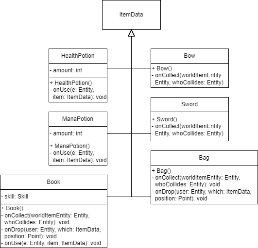

# Items

Titel: Konzeptskizze für Zyklus

Author: Bent Schöne, Marvin Petschulat, Edwin Dik

---
## Beschreibung der Aufgabe

Es sollen drei verschiedene Typen von Gegenständen im Dungeon implementiert werden, die der Spieler verwenden kann.

Darüber hinaus sollen Taschen implementiert werden, die das Inventar des Spielers um mehrere Inventarplätze
erweitern sollen, die Taschen sollen dabei selbst einen Inventarplatz belegen und können auch nur eine
begrenzte Anzahl an Gegenständen aufbewahren.

Außerdem sollen alle Gegenstände grafisch dargestellt werden.

---

## Beschreibung der Lösung

Implementiert werden Bücher, die der Spieler benutzen kann.
Es gibt unterschiedlich aussehende Bücher, die jeweils unterschiedliche Skills enthalten.

Außerdem gibt es
unterschiedlich aussehende Schwerter und Bögen, die Farbe des Items soll den Schaden definieren.

Es gibt 3 verschiedene Arten von Schwerten und Bögen:

| Farbe  | Bronze | Silber | Ruby   |
|--------|--------|--------|--------|
| Damage | 1      | 2      | 3      |

Dazu wird auch noch ein Manatrank und ein Heilungstrank implementiert,
die jeweils eine bestimmte Anzahl an Mana und Lebenspunkten des Spielers wiederherstellen.

Die Bücher werden schon vorhandene Skills benutzten. Manche Skills werden erst ab einen bestimmten Hero Level
freigeschaltet, diese spawnen dann erst wenn der Hero das jeweilige Level erreicht hat. Feuerball und Spark können
schon ab Hero Level 0 gefunden werden. Frost Nova kann erst ab Hero Level 5 gefunden werden und Gravity Storm ab Hero
Level 10.

Das Inventar wird durch den Hotkey (I) geöffnet und pausiert das Spiel. Danach wird das
Inventar in der Konsole ausgegeben, und von dort aus kann man dann einzelne Items benutzten oder fallen lassen.

Der Spieler hat ein Inventar mit insgesamt 5 Slots, ein Equipment Slot für ein Schwert oder einen Bogen,
2 Skill Slots für Bücher und 2 allgemeine Inventarplätze für z.B. Tränke.

Items können durch eine Kiste im Level gefunden werden. Jedes Level hat jeweils eine Kiste.

---
## Methoden und Techniken

Methoden werden wieder gemäß der Vorlesung mit Javadoc dokumentiert.

Für die Versionskontrolle wird Git verwendet.

Logging wird schon durch die Klasse ``InventoryComponent`` übernommen wenn ein Item hinzugefügt oder gelöscht wird.

### Erklärung von ItemData
ItemData definiert wie das Item auf dem Boden und im Inventar aussieht, welche Art von
Item es ist (ItemType) und was passieren soll, wenn es aufgehoben, benutzt und fallen gelassen wird.

Es gibt 3 verschiedene Item Typen: Basic, Active und Passive. Basic Items haben keine speziellen Eigenschaften.
Active Items haben eine ``IOnUse`` Funktion die aufgerufen wird, wenn man das Item benutzt. Passive Items
besitzen einen DamageModifier, der ein Multiplikator speichert.

Items benutzen die Interfaces ``IOnCollect``, ``IOnDrop``, ``IOnUse`` um ihr Verhalten in den verschiedenen
Situationen zu definieren.

### Erklärung des InventoryComponents
Speichert eine List aus ItemData's. Die Liste kann mit addItem und removeItem manipuliert werden.
Die Größe der Liste ist durch die Variable ``int maxSize`` begrenzt.

---

## Ansatz und Modellierung

### Inventar in der Konsole

Da wir derzeit noch keine andere Möglichkeit haben das Inventar darzustellen müssen wir es erstmal in der Konsole tun.
Dafür wird eine neue Klasse ``InventoryVisuals`` erstellt. In der Klasse wird es eine Methode ``print()``
geben, die das Inventar ausgibt und danach eine Eingabe erwartet. Der Spieler kann entweder ein Item benutzen, ein Item
fallen lassen oder das Inventar schließen.

### Bücher

Um die Bücher zu implementieren wird eine neue Klasse ``Book`` erstellt. Diese Klasse erbt von ItemData.
Wenn ein neues Buch Objekt erstellt wird, wird diesem Buch ein zufälliger Skill zugewiesen. Dabei wird das Hero Level
beachtet, weil Frost Nova und Gravity Storm, Level abhängig sind. Die Textur vom Buch ist vom Skill abhängig.

Damit das Buch sich so verhält, wie wir uns das Vorstellen müssen wir eigene ``IOnUse``, ``IOnDrop`` und ``IOnCollect``
Funktionen in der ``Book`` Klasse implementieren.

Wenn ein Buch aufgehoben wird (``IOnCollect``), wird es im SkillComponent vom Hero gespeichert, und in einem Skill Slot im
InventoryComponent gespeichert. Wenn es keinen freien Skill Slot gibt, wird das Buch in das Inventar gelegt.

Wenn ein Buch aus dem Inventar fallen gelassen werden soll(``IOnDrop``), wird ein neuer Entity mithilfe vom dem ``WorldItemBuilder`` erstellt,
und das Buch aus dem Inventar und dem SkillComponent vom Hero gelöscht.

Wenn das Buch im Inventar benutzt wird(``IOnUse``), wird gefragt in welchen Skill Slot es soll. Danach wird das Buch im Skill Slot mit dem
Buch aus dem Inventar ausgetauscht. Dabei wird der SkillComponent vom Hero aktualisiert.

### Schwert und Bogen

Um Schwerter und Bögen zu implementieren werden 2 neue Klassen ``Bow`` und ``Sword`` erstellt die beide von ItemData erben.
Wenn ein Bogen oder Schwert Objekt erstellt wird, wird ein neuer zufälliger ``DamageModifier`` erstellt.
Dabei ist die Textur vom DamageModifier abhängig.

Dem Spieler soll es nicht möglich sein ein Schwert oder einen Bogen fallen zu lassen, sondern nur zu ersetzten,
daher muss keine ``IOnDrop`` Funktion definiert werden. Außerdem werden Bogen und Schwert Passive Items also haben sie keine ``IOnUse`` Funktion.

Wenn ein Bogen oder Schwert aufgehoben wird (``IOnCollect``), wird das Item im Equipment Slot mit dem aufgehobenen Item ersetzt.
Dabei wird der SkillComponent vom Hero aktualisiert.

### Tränke

Um Heiltränke und Manatränke zu implementieren werden zwei neue Klassen ``HealthPotion`` und ``ManaPotion`` erstellt,
die beide von ItemData erben.

Weil beide Tränke Active Items sind brauchen sie eine ``IOnUse`` funktion.

Wenn ein Trank benutzt wird (``IOnUse``), wird die jeweilige Ressource um einen Wert erhöht und das Item gelöscht.

Beide Tränke benutzten die default Funktionen für ``IOnCollect`` und ``IOnDrop``.

### Tasche

Um Taschen zu implementieren wird eine neue Klasse ``Bag`` implementiert die von ItemData erbt.

Eine Tasche ist ein Basic Item also hat es keine speziellen Eigenschaften.

Wenn eine Tasche aufgehoben wird (``IOnCollect``), wird das Inventar um 2 Slots erweitert und die
Tasche wird auf einen freien Inventarplatz gelegt.

Wenn eine Tasche fallen gelassen werden soll(``IOnDrop``), wird die größe vom Inventar wieder um 2 Slots verringert und die
Tasche mit Hilfe vom ``WorldItemBuilder`` als Entity auf dem Boden dargestellt. Wenn das Inventar nicht verringert
werden kann, also es weniger als 2 freie Inventarplätze gibt, wird die Tasche nicht fallen gelassen, und es müssen erst Items
aus dem Inventar fallen gelassen werden.

---

## UML

