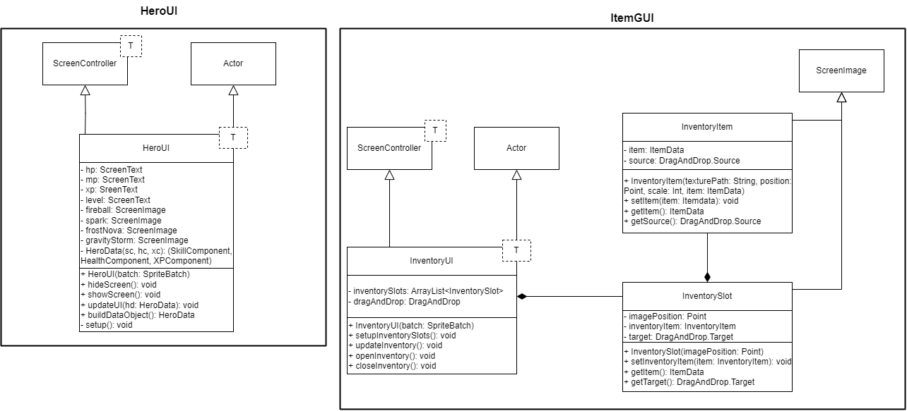

# HeroUI und InventarGUI
Titel: Konzeptskizze für Zyklus 4

Author: Bent Schöne, Marvin Petschulat, Edwin Dik

---
## Beschreibung der Aufgabe
### InventarGUI
Implementiert soll ein Inventar-GUI. Das Inventar soll mit einem hotkey geöffnet werden und das Spiel soll dabei pausiert werden.

### HeroUI
Es soll ein Spieler HUD erstellt werden, welches dem Spieler seine Lebenspunkte, Manapunkte,
aktuelle XP, aktuelles Level und Skills mit cooldown anzeigt.
---

## Beschreibung der Lösung
### InventarGUI
Das Inventar kann mit dem Hotkey "i" geöffnet und geschlossen werden.

Items können mit Drag&Drop im Inventar bewegt werden. Wenn ein Item außerhalb vom Inventar bewegt wird, wird das Item auf dem boden gelegt.

Item name und beschreibungstext wird angezeigt, wenn die maus über ein Item gezogen wird.

Mit rechtsklick wird ein kontextmenü vom Item geöffnet. Dort sieht man alle aktionen die das Item machen kann. (use, drop)

Items können im Inventar mit doppelklick benutzt werden.

### HeroUI
Lebenspunkte, Manapunkte usw. werden oben links im Spiel angezeigt. Die Skills
werden unten links angezeigt. Wenn ein Skill auf cooldown ist, wird er ausgegraut und ein
es wird ein Timer angezeigt, der die Zeit bis zum Ende des cooldowns anzeigt. Alle
Werte des HUDs und die Skills werden jeden Frame aktualisiert damit sie immer
aktuell sind.

Beim Lösen der aufgabe werden die Issues [#234](https://github.com/Programmiermethoden/Dungeon/issues/234) und [#329](https://github.com/Programmiermethoden/Dungeon/issues/329) als Inspiration genommen.

---

## Methoden und Techniken

Methoden werden wieder gemäß der Vorlesung mit Javadoc dokumentiert.

Für die Versionskontrolle wird Git verwendet.

Logging wird in der aufgabe InventarGUI ausgegeben jedes Mal, wenn ein neues Inventar erstellt wird.

---

## Ansatz und Modellierung

### InventarGUI

Damit items in Inventar mit Drag&Drop bewegt werden können, benutzten wir die Klasse
``DragAndDrop`` aus der bibliothek gdx. Dort kann man Actors als ``Source`` und ``Target`` definieren.

Unsere Targets, also wo die items gedropped wenden können, werden Inventar slots sein. Dafür erstellen wir
eine neue Klasse ``InventarSlot`` die von ScreenImage erbt und eine Position hat. Die Klasse wird dann als
DragAndDrop Target definiert damit dort Items gedropped werden können.

Unsere Sources, also Items die man ziehen kann, werden mit der Klasse ``InventarItem`` erstellt. Die Klasse
erbt von ScreenImage und erwartet ein Item und Position als Parameter. Außerdem wird die Klasse als DragAndDrop
Source definiert damit man von einem InventarItem Objekt ein Item ziehen kann.

Damit man den namen und description vom Item sieht wenn man über das Item mit der Maus hovered
implementieren wir ein ``ClickListener`` in InventoryItem. Von der Klasse ClickListener überschreiben wir
die Methoden ``enter()`` und ``exit()`` die ausgeführt werden wenn die Maus in den InventoryItem gehen und wenn
die Maus aus dem InventoryItem geht.

ClickListener hat außerdem die Methode ``clicked()`` die jedes Mal ausgeführt wird wenn das InventoryItem angeklickt wird.
In dieser methode kann man ``getTapCount()`` aufrufen um zu gucken wie oft der Actor hintereinander gedrückt wurde.

Für das Kontextmenü muss noch ein ``ClickListener`` erstellt werden der nur auf rechtsklicks achtet.
Dort kann man die Methode ``clicked()`` überschreiben.

### HeroUI
Es gibt eine neue Klasse ``HeroUI`` die das HUD verwaltet, diese erbt von
dem bereits vorgegebenen ``ScreenController``.

Die Klasse hat folgende Attribute:

- ``ScreenText hp, mp, xp, level``: ScreenTexte für die Lebenspunkte, Manapunkte, XP und das Level.
- ``ScreenImage fireball, spark, frostNova, gravityStorm``: ScreenImages für die Skills.

Abgesehen davon soll die Klasse auch noch einen record ``HeroData`` haben, welcher den
SkillComponent, HealthComponent und XPComponent des Spielers enthält.

In der Klasse wird es außerdem noch folgende
neue Methoden geben:

- ``HeroUI()``: Konstruktor der Klasse, ruft alle nötigen Methoden zum setup des
  HUDs auf.
- ``hideScreen()``: Versteckt das HUD.
- ``showScreen()``: Zeigt das HUD an.
- ``setup()``: Erstellt alle ScreenTexte und ScreenImages und fügt sie dem Controller
  hinzu.
- ``buildDataObject()``: Gibt das HeroData Objekt mit den Components des Spielers zurück.
- ``updateUI()``: Aktualisiert alle ScreenTexte und ScreenImages mit den aktuellen Werten.

---

## UML

