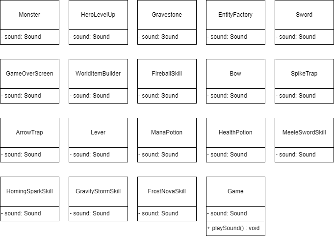

Titel: Konzeptskizze für Zyklus

Author: Bent Schöne, Marvin Petschulat, Edwin Dik

---
## Beschreibung der Aufgabe

Es sollen für alle möglichen Optionen für Sound Effekte, Sounds eingebaut werden.

---

## Beschreibung der Lösung

Implementiert werden sollen Sounds für:
- Main-Game (ab verschiedene Etagen andere Musik)
- Game-Over ScreenG
- Kisten öffnen
- Leiter klettern
- Potion einsetzen
- Items aufnehmen
- Schwert/Bogen wechseln
- Skills anwenden(Pfeil, Schwert, Fireball)
- Levelup Sound
- Fallen Sounds (+Lever)
- NPC Geist beim Healen
- Monster stirbt
- Monster wird getroffen
- ?Hero läuft?

---

## Methoden und Techniken

Methoden werden wieder gemäß der Vorlesung mit Javadoc dokumentiert.
Sounds werden geloggt.
Für die Versionskontrolle wird Git verwendet.
---

## Ansatz und Modellierung

Es wird das Vorhandene Interface `Sounds.java` verwendet
und als Instanz in den jeweiligen Klassen implementiert um die jeweiligen Sounds abzuspielen.
Die Instanz soll dann in einem Exception mit dem Code: `Gdx.audio.newSound(Gdx.files.internal("file.mp3"));` , das für das setzen des Sounds ist,
gesetzt und mit `.play(volume)` `.loop(volume)` abgespielt werden.
Die Exception soll mit `GdxRuntimeException` abgefangen werden.

Manche Sounds wie z.b "Entity wird getroffen" und "Entity stirbt", passieren von dem Hero an einem anderen Ort deswegen macht es Sinn es zu pannen.
Es soll geguckt werden wo der Hero ist und wo der Sound spielen soll. Dazu soll berechnet werden wie weit Links oder wie weit rechts der Sound abgespielt werden soll.
So wird mit der Methode aus dem Interface `.play (volume, pitch, pan)` die Variable pan dann gesetzt.

Für die Main Game Musik wird eine neue Methode in `Game.java` erstellt `playSound()`, dort wird die Variable `depth` abgefragt auf welcher Etage man ist um die jeweilige Musik zu spielen.

Die float Variable `volume`, die für die Lautstärke benutzt wird (Range 0,1),
wird je nach ermessen eingestellt (Abhängig wie laut der Sound ist und wie laut er im Spiel zuhören sein soll).

Extra!: Wir haben vor die Sounds zu samplen bzw teilweise selber zuerstellen über FL-Studio,
damit wir die einheitlich bekommen und wieder einzigartige Elemente ins Dungeon bekommen.

---

## UML

