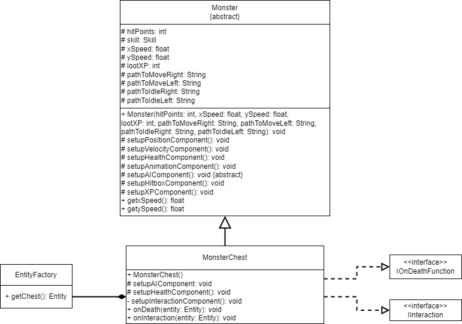

# Monster-Schatzkiste

---

## Beschreibung der Aufgabe

Dem dungeon soll eine Monster-Schatzkiste hinzugefügt werden.

---

## Beschreibung der Lösung

Die Monster-Schatzkiste soll so aussehen wie eine normale Kiste, bis der Spieler
mit der Kiste interagiert. Sobald der Spieler mit der Kiste interagiert, wird die Kiste zu einem Monster
und greift den Spieler an. Wenn die Monster-Schatzkiste besiegt wurde, wird sie wieder zu einer
normalen Kiste und lässt beim Interagieren wieder Gegenstände fallen.

---

## Methoden und Techniken

Methoden werden wieder gemäß der Vorlesung mit Javadoc dokumentiert.

Für die Versionskontrolle wird Git verwendet.

### EntityFactory Chest erklärung

Die Klasse `EntityFactory` ist eine Klasse, mit der Entities erstellt.
Die Methode `getChest()` erstellt ein Entity mit folgenden Komponenten:
- PositionComponent: Zum speichern der Position
- InventoryComponent: Zum speichern der Items
- InteractionComponent: Zum Interagieren mit der Kiste
- DrawComponent: Zum Darstellen der Kiste im Dungeon

Beim Erstellen einer Kiste werden 1-3 zufällige Items generiert und in den
InventoryComponent der Kiste hinzugefügt. Wenn mit der Kiste interagiert wird,
werden die OnDrop Methoden der Items ausgeführt.

---

## Ansatz und Modellierung

Eine neue Klasse `MonsterChest` soll erstellt werden, die von der Klasse `Monster` erbt.
Der Kiste wird ein InteractionComponent gegeben. Wenn mit der Kiste interagiert wird,
wird der Kiste ein AIComponent gegeben, womit die Kiste dann angreift.
Wenn das Monster besiegt wurde, wird eine normale Kiste gespawnt.

Wenn mit der Kiste interagiert wird, wird der Kiste folgende AI's gegeben:
- Als FightAI wird die CollideAI benutzt
- Als IdleAI wird der StaticRadiusWalk benutzt
- Als TransitionAI wird die RangeTransition benutzt

---

## UML

